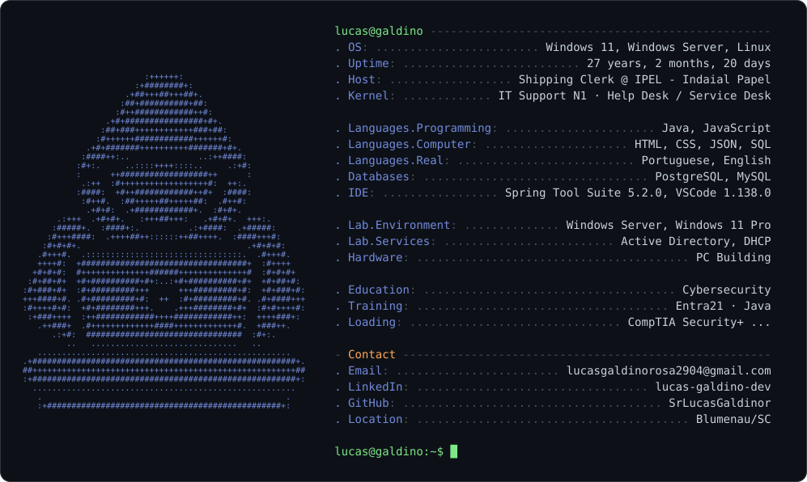

  <picture>
    <source media="(prefers-color-scheme: dark)" srcset="dark_mode.svg">
    <source media="(prefers-color-scheme: light)" srcset="light_mode.svg">
    
  </picture>

  

---

### 🖥️ Tecnologias

  
  

 

  Arte ASCII baseada em ícone de <a href="https://www.flaticon.com/">Freepik / Flaticon</a>

